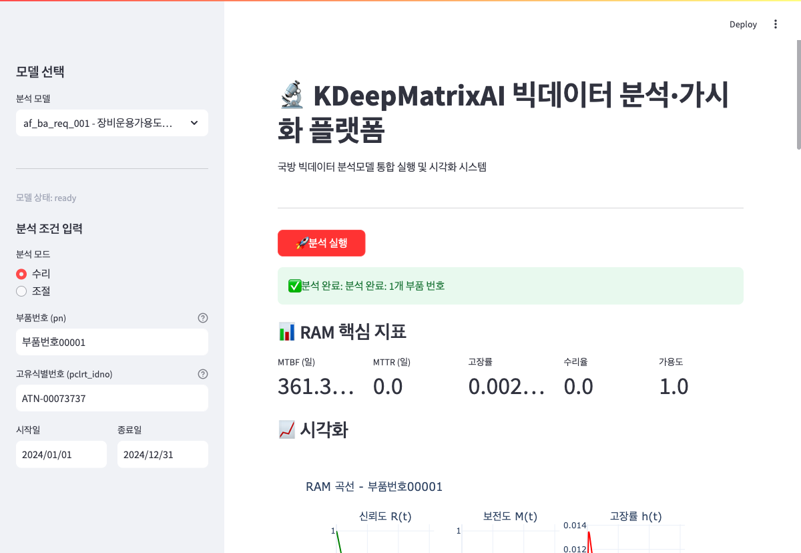

# KDeepMatrixAI

> 국방 빅데이터 분석·가시화 통합 플랫폼  
> Defense Big Data Analysis & Visualization Platform

기존 Python 분석모델 5개를 **수정하지 않고**, 신규 코드만 추가하여 웹 기반 통합 분석 환경을 구축합니다.  
사용자는 브라우저에서 분석 조건을 입력하고, 실시간으로 RAM 지표(MTBF/MTTR/가용도)와 인터랙티브 차트를 확인할 수 있습니다.

---

## 📸 실행 화면

### 메인 화면


### 분석 결과 화면 (RAM 지표 + 시각화)


---

## 🏗️ 시스템 아키텍처

```
┌─────────────────────────────────────────────────────────────┐
│                        사용자 (Browser)                       │
└───────────────────────────┬─────────────────────────────────┘
                            │
┌───────────────────────────▼─────────────────────────────────┐
│                   Streamlit Frontend                         │
│  ┌─────────────┐  ┌──────────────┐  ┌──────────────────┐   │
│  │ 모델 선택   │  │ 조건 입력    │  │ 결과 표시        │   │
│  │ (사이드바)  │  │ (동적 폼)    │  │ 지표/차트/테이블 │   │
│  └─────────────┘  └──────────────┘  └──────────────────┘   │
└───────────────────────────┬─────────────────────────────────┘
                            │ HTTP / REST API
┌───────────────────────────▼─────────────────────────────────┐
│                    FastAPI Backend                           │
│  ┌─────────────────────────────────────────────────────┐   │
│  │  /api/v1/models    - 모델 목록 조회                 │   │
│  │  /api/v1/analyze/ram - RAM 분석 실행                │   │
│  │  /api/v1/analyze/{model_id} - 범용 분석 실행        │   │
│  └─────────────────────────────────────────────────────┘   │
│                                                              │
│  ┌──────────────┐  ┌─────────────┐  ┌──────────────────┐   │
│  │ model_registry│  │ services/   │  │ models/schemas   │   │
│  │ (자동 스캔)   │  │ (분석 엔진) │  │ (Pydantic DTO)   │   │
│  └──────────────┘  └─────────────┘  └──────────────────┘   │
└───────────────────────────┬─────────────────────────────────┘
                            │
┌───────────────────────────▼─────────────────────────────────┐
│                   Analysis Engine                            │
│  ┌─────────────────────────────────────────────────────┐   │
│  │  af_ba_req_001 (RAM)  ←── lifelines 분포 적합       │   │
│  │  af_ba_req_002 (수명)  ── 구조 등록 완료            │   │
│  │  af_ba_req_004 (시뮬)  ── 구조 등록 완료            │   │
│  │  af_ba_req_005 (추천)  ── 구조 등록 완료            │   │
│  │  af_ba_req_007 (IMQC)  ── 구조 등록 완료            │   │
│  └─────────────────────────────────────────────────────┘   │
└───────────────────────────┬─────────────────────────────────┘
                            │
┌───────────────────────────▼─────────────────────────────────┐
│                      Data Layer                              │
│  ┌─────────────────────────────────────────────────────┐   │
│  │  data/ (xlsb/xlsx/csv) - 원본 데이터 (Read-Only)    │   │
│  │  outputs/{analysis_id}/ - 분석 결과 저장소           │   │
│  │    ├─ summary.csv          - RAM 지표 요약          │   │
│  │    ├─ visualization.csv    - 곡선 데이터            │   │
│  │    ├─ timeline.csv         - 일별 가동/비가동 로그  │   │
│  │    ├─ charts/*.html        - Plotly 차트            │   │
│  │    └─ report.html          - 통합 HTML 보고서       │   │
│  └─────────────────────────────────────────────────────┘   │
└─────────────────────────────────────────────────────────────┘
```

---

## 📁 디렉터리 구조

```
KDeepMatrixAI/
│
├─ af_ba_req_001/                  # 기존 분석모델 (수정 금지)
│   ├─ data/
│   │   └─ 가용도분석자료.xlsb       # 327,699행 x 5컬럼
│   └─ 장비운용가용도분석.py        # 기존 Python 소스
│
├─ af_ba_req_002/                  # 기존 분석모델 (수정 금지)
│   ├─ data/
│   └─ 장비수명예측.py
│
├─ af_ba_req_004/                  # 기존 분석모델 (수정 금지)
│   ├─ Simulation_054.py
│   └─ Simulation_055.py
│
├─ af_ba_req_005/                  # 기존 분석모델 (수정 금지)
│   ├─ db/
│   ├─ log/
│   └─ test.py
│
├─ af_ba_req_007/                  # 기존 분석모델 (수정 금지)
│   ├─ datasets/
│   ├─ run_ba_req_07_20251127.py
│   └─ utils.py
│
├─ app/
│   └─ app.py                      # Streamlit 실행 진입점
│
├─ backend/
│   ├─ main.py                     # FastAPI 서버
│   ├─ model_registry.py           # af_ba_req_* 자동 스캔
│   ├─ core/
│   │   ├─ config.py               # 전역 설정 (상수, 경로)
│   │   └─ exceptions.py           # 커스텀 예외 클래스
│   ├─ api/v1/
│   │   ├─ models.py               # GET /api/v1/models
│   │   └─ analysis.py             # POST /api/v1/analyze/*
│   ├─ models/
│   │   ├─ schemas.py              # Pydantic 요청/응답 스키마
│   │   └─ adapters.py             # AnalysisModelAdapter 인터페이스
│   ├─ services/
│   │   ├─ base.py                 # BaseAnalysisService 추상 클래스
│   │   ├─ ram_service.py          # af_ba_req_001 RAM 분석 (핵심)
│   │   ├─ life_service.py         # af_ba_req_002 (구조만)
│   │   ├─ sim_service.py          # af_ba_req_004 (구조만)
│   │   ├─ recommend_service.py    # af_ba_req_005 (구조만)
│   │   └─ imqc_service.py         # af_ba_req_007 (구조만)
│   └─ utils/
│       ├─ data_loader.py          # xlsb/xlsx/csv 로더
│       ├─ date_utils.py           # Excel serial date 변환
│       └─ viz_utils.py            # Plotly 차트 생성 유틸
│
├─ frontend/
│   ├─ components/
│   │   ├─ model_selector.py       # 모델 선택 사이드바
│   │   ├─ input_forms.py          # 동적 입력 폼 (모델별)
│   │   ├─ metric_cards.py         # RAM 지표 카드 렌더링
│   │   ├─ charts.py               # Plotly 차트/테이블 표시
│   │   └─ data_table.py           # 결과 테이블 + CSV 다운로드
│   └─ pages/
│       ├─ home.py                 # 메인 페이지 (미사용, app.py 통합)
│       └─ results.py              # 결과 상세 (미사용, app.py 통합)
│
├─ docs/
│   ├─ KIMI_CODE_DEV_PROMPT.md     # 개발 지침서
│   └─ images/                     # 스크린샷 저장소
│       ├─ kdeep_ui_main.png
│       └─ kdeep_ui_success.png
│
├─ tests/
│   ├─ test_quick.py               # 빠른 통합 테스트
│   └─ test_ram_service.py         # RAM 서비스 단위 테스트
│
├─ outputs/                        # 분석 결과 저장소 (.gitignore)
│
├─ requirements.txt                # Python 의존성
├─ README.md                       # 본 파일
└─ .gitignore
```

---

## 🔬 핵심 분석 로직 (af_ba_req_001)

### 데이터 흐름도

```
[가용도분석자료.xlsb]
        │
        ▼
[Data Loader] ── pyxlsb → pandas DataFrame
        │
        ▼
[Preprocess]
  ├─ 상태코드 변환: C,H,S → J / L → K
  ├─ 유효코드 필터: F, G, J, K
  ├─ 날짜 필터링: start_date < mntnc_reqstdt < end_date
  └─ event_status 생성: mode='수리' → J=가동, 나머지=비가동
        │
        ▼
[Timeline 생성]
  ├─ Rule 1: start_date ~ 첫 의뢰일 → 가동
  ├─ Rule 2: 의뢰일~출고일 → event_status (가동/비가동)
  └─ Rule 3: 출고일~다음 의뢰일 → 가동 (공백 채움)
        │
        ▼
[TBF / TTR 추출]
  ├─ TBF (가동 기간) durations + right-censored 이벤트
  └─ TTR (비가동 기간) durations + right-censored 이벤트
        │
        ▼
[분포 적합 (lifelines)]
  ├─ WeibullFitter
  ├─ LogNormalFitter
  └─ ExponentialFitter
        │
        ▼
[AIC 기반 최적 분포 선택]
        │
        ▼
[RAM 지표 계산]
  ├─ MTBF  = best_tbf_dist.mean
  ├─ MTTR  = best_ttr_dist.mean
  ├─ failure_rate = 1 / MTBF
  ├─ repair_rate  = 1 / MTTR
  └─ availability = MTBF / (MTBF + MTTR)
        │
        ▼
[시각화 (Plotly)]
  ├─ 신뢰도 R(t) 곡선
  ├─ 보전도 M(t) 곡선
  ├─ 고장률 h(t) 곡선
  └─ 운용가용도 막대그래프
```

### 상태코드 처리 규칙

| 원본 코드 | 변환 | 의미 | mode='수리' | mode='조절' |
|---|---|---|---|---|
| C, H, S | → J | 정비완료 | 가동 | 비가동 |
| L | → K | 폐기/불용 | 비가동 | 비가동 |
| F, G | - | 불량/기타 | 비가동 | 비가동 |
| J | - | 정상 | 가동 | 비가동 |
| K | - | 폐기 | 비가동 | 비가동 |

---

## 🚀 설치 및 실행

### 1. Clone
```bash
git clone https://github.com/kbitone-bot/KDeepMatrixAI.git
cd KDeepMatrixAI
```

### 2. 의존성 설치
```bash
pip install -r requirements.txt
```

핵심 패키지:
- `fastapi`, `uvicorn` — 백엔드 API 서버
- `streamlit` — 프론트엔드 UI
- `pandas`, `pyxlsb`, `openpyxl` — 데이터 로딩
- `lifelines` — 생존/신뢰성 분석 (Weibull/LogNormal/Exponential)
- `scipy`, `numpy` — 수치 계산
- `plotly` — 인터랙티브 시각화

### 3. Streamlit 실행 (권장)
```bash
streamlit run app/app.py
```
브라우저가 자동으로 열리며, 사이드바에서 모델 선택 → 조건 입력 → 분석 실행 순서로 사용합니다.

### 4. FastAPI 서버 실행 (선택)
```bash
uvicorn backend.main:app --reload
```
Swagger UI: http://localhost:8000/docs

---

## 📡 API 명세

### 모델 목록 조회
```bash
GET /api/v1/models
```

### RAM 분석 실행
```bash
POST /api/v1/analyze/ram
Content-Type: application/json

{
  "mode": "수리",
  "no_pn": "부품번호00001",
  "no_pclrt_idno": "ATN-00073737",
  "start_date": "2024-01-01",
  "end_date": "2024-12-31"
}
```

**응답 예시:**
```json
{
  "analysis_id": "xxxxxxxx-xxxx-xxxx-xxxx-xxxxxxxxxxxx",
  "status": "success",
  "metrics": {
    "summary": [{
      "mtbf": 361.3829,
      "mttr": 0.0,
      "failure_rate": 0.002767,
      "repair_rate": 0.0,
      "availability": 1.0,
      "best_tbf_dist": "LogNormal",
      "best_ttr_dist": null
    }]
  },
  "summary_csv": "outputs/.../summary.csv",
  "viz_csv": "outputs/.../visualization.csv",
  "charts": ["outputs/.../charts/ram_curves_...html"],
  "report_html": "outputs/.../report.html"
}
```

---

## 📊 결과 저장 구조

분석이 완료되면 `outputs/{analysis_id}/` 디렉터리에 다음 파일이 생성됩니다.

```
outputs/{analysis_id}/
├─ summary.csv              # pn별 MTBF, MTTR, 고장률, 수리율, 가용도
├─ visualization.csv        # 시간축별 신뢰도/보전도/고장률 데이터
├─ timeline.csv             # 일별 가동(1)/비가동(0) 로그
├─ charts/
│   ├─ ram_curves_{pn}.html   # 신뢰도/보전도/고장률 3분할 차트
│   └─ availability_{pn}.html # 운용가용도 막대그래프
└─ report.html              # 통합 HTML 보고서
```

---

## 🧪 테스트

```bash
# 빠른 통합 테스트 (데이터 로드 + RAM 분석)
python tests/test_quick.py

# 단위 테스트 (데이터 로더, 날짜 변환, RAM 서비스)
python tests/test_ram_service.py
```

---

## ⚠️ 예외 처리 전략

| 예외 | 발생 상황 | 처리 방식 |
|---|---|---|
| `DataLoadError` | xlsb 파일 없음/손상 | 400 응답 + 에러 메시지 |
| `ColumnNotFoundError` | 필수 컬럼 누락 | 400 응답 + 누락 컬럼 목록 |
| `EmptyDataError` | 필터링 후 데이터 0건 | 400 응답 + 조건 수정 안내 |
| `DistributionFitError` | 분포 적합 실패 | 중앙값 fallback / 0 처리 |
| `VisualizationError` | 차트 생성 실패 | 빈 차트 반환 + 로그 기록 |

---

## 🗺️ 개발 로드맵

| 우선순위 | 모델 | 상태 | 비고 |
|---|---|---|---|
| 1 | af_ba_req_001 (RAM) | **완료** | MTBF/MTTR/가용도 + 시각화 |
| 2 | af_ba_req_002 (수명예측) | 구조 등록 | B10/B50 수명, CDF/PDF 플롯 |
| 3 | af_ba_req_004 (시뮬레이션) | 구조 등록 | Bootstrap CI, 역추정 |
| 4 | af_ba_req_005 (유사부품) | 구조 등록 | KMeans + TF-IDF 추천 |
| 5 | af_ba_req_007 (IMQC) | 구조 등록 | 인원수급 산출 |

---

## 👤 작성자

- **Maintainer**: choikb (kyubeom@kbict.com)
- **Repo**: https://github.com/kbitone-bot/KDeepMatrixAI
- **License**: MIT (신규 코드에 한함, 기존 분석모델 저작권은 원 소유자에게 있습니다)
